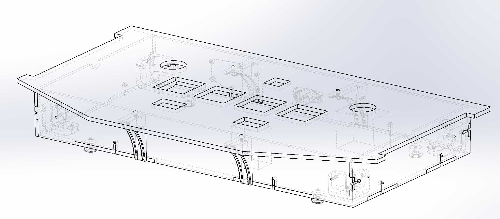

# SDVX-Panel-Conversion
Turn an arcade Sound Voltex panel into a controller.

Requires a 1x2ft laser cutter, a 3d printer, and an assortment of m3 and m4 nuts and bolts.  And rubber feet.  And some more stuff.

issues:  
- arduino holes didn't exactly line up, i just screwed in 2 screws diagonally and called it a day
- the m3x20 screws may fall out.  the corner brackets seem to do a good enough job,  can super glue m3 washers to make the m3x20 screws stay.

Note: PCB folder contains a side led rgb pcb which i was originally going to use, but the pcba turned out too expensive so I have went with the 3d printed mount instead

requires:  
- 2 1/4" 1x2ft plywood panels - mine came out to be 5.5mm..so ymmv.  Laser cut with box_dxf, units are mm
- 3d printed parts: 4 corner_bracket, 2 back_mount, 2 front_mount, 1 usb_mount, 1 arduino_leonaro_mount, 1 led_3dp, and 1 led_3dp but print mirrored
- 3m mounting tape for arduino and led sides
- m3x6 arduino
- m3x20 edges
- m3x16 corner brackets
- m4x12 panel to box mount
- m3 nuts
- m4 nuts
- m3 washers
- m4 washers
- m4xsomething nuts to mount arcade panel to box
- m4 screwable rubber feet.  I got these https://www.mcmaster.com/8884T21
- top screws.  got them from a friend, they look like m4 low/slim profile of some sort.  m4x16 or something.
- ws2812b strip - i got 1m of 144leds/m because why not.

Assembly:  
- Note: I recommend doing a washer wherever a screw head touches wood or a 3d print.
- screw together box sides
- screw in corner pieces
- glue usb c - micro b extender into the usb holder
- screw in usb holder
- screw in front and back 3d printed mounts to box, don't forget to add nuts to all 3 points
- screw in panel
- mount arduino to plastic holder, apply 3m tape to holder.
- create wiring harness or just use dupont breadboard extenders and plug it directly into the connector using the wiring guide.  I recommend grouping all the - and COM to ground, except L/R Pot -, which get their own dedicated wire to ground
- don't forget to wire up ws2812b, needs to tap into 5v and gnd of the harness and each side has its own dedicated data line.  Cut to length, for mine i did 31 leds per side.
- assuming you've wired up arduino, plug in the micro usb adapter, peel off other side of 3m tape and mount it inside.  for me, i did it in the top left corner(looking at the top of the panel)
- string ws2812b strips through the half circle gaps to the outside of the box.
- apply mounting tape to edges of led_3dp part, then stick ws2812b strip to the mount.  Peel mounting tape and apply to panel.  Repeat for other side.
- mount feet to the bottom panel
- screw in the bottom panel

Setup https://github.com/veroxzik/arduino-konami-spoof (C:\Program Files (x86)\Arduino\hardware for me) and flash SkogaVoltex.  Might need to add arduino joystick library(just google it and import the zip).  Fastled, bounce2, and responsiveanalogread libraries can be installed through tools -> manage libraries.

This work is licensed under a Creative Commons Attribution-NonCommercial-ShareAlike 4.0 International License.

My build, including extras:  
dupont	7.3  
ws2812b	8.26  
panel	63.51  
shipping	69.5  
arduino	14.99  
usb c to micro b	1.915  
wood	8.47  
screws	15.89  
feet	3.18  
3d prints	5  
jst	0  
wire	1  
torque limiter	44  
yuan leds	11.01  
usb c cable	1  
knobs	19.98 
3m tape 5 

Total: 280.005